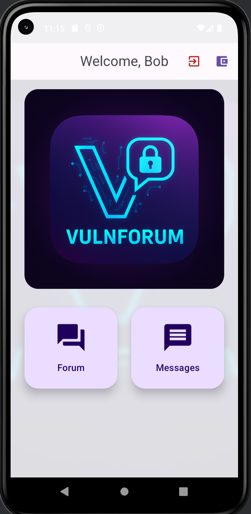

# 📱 VulnForum – An Intentionally Vulnerable Mobile Application (Android Jetpack Compose + Flask)

[](https://opensource.org/licenses/MIT)
[](https://developer.android.com/jetpack/compose)
[](https://flask.palletsprojects.com/en/3.0/)

**VulnForum** is an open-source, intentionally vulnerable Android forum application designed as a hands-on learning and training target for mobile application security testing.

The project simulates a realistic application scenario (a user-to-user forum) using **modern development technologies** (Android Jetpack Compose and Python Flask).

---

## 🌟 Key Features & Educational Value

VulnForum provides a comprehensive range of real-world flaws, making it an ideal target for:

* **Penetration Testing Practice:** Covering vulnerabilities from client-side issues (IPC, Insecure Storage) to server-side flaws (SQLi, XSS).
* **Modern Tech Stack:** Using **Jetpack Compose** and **Kotlin** on the client, which is crucial for modern Android security training.
* **Developer Training:** Helping developers understand common threats from a security perspective.

---

## 🛠️ Technology Stack

| Component | Technology | Description |
| :--- | :--- | :--- |
| **Mobile App (Frontend)** | Kotlin, Android Jetpack Compose | Modern UI toolkit for Android, targeting current APIs. |
| **Backend API** | Python, Flask, SQLite | Simple REST API for data persistence and user management. |

---

## 🔐 Vulnerabilities Index

VulnForum includes a wide array of common mobile and API security issues, mapped directly to real-world testing methodologies.

* **Exported Components** (Activities, Broadcast Receivers)
* **SQL Injection** & Data Handling Flaws
* **Cross-Site Scripting (XSS)**
* **Broken Authentication and Authorization** (Token Mismanagement)
* **Insecure Data Storage** (Improper Encryption, Hardcoding)
* **Abusable Deep Links**
* **Insecure API Configuration** (CORS)
* **Sensitive Data Leakage** (Logging, Error Messages)

**For a detailed description of each vulnerability, including its location and mapping to MASTG controls, please see the [VULNERABILITIES.md] file.**

---

## ▶️ Setup and Running

The following instructions will get the VulnForum environment running locally.

### Prerequisites

* Android Studio / ADB
* Python 3.x
* **Emulator/Device:** Ensure your emulator is running, or a physical device is connected, before starting the backend, as the application relies on the host-to-emulator network setup (e.g., Docker port forwarding, or using the 10.0.2.2 gateway) to connect.

### 1. Launch Emulator / Connect Device

Start your Android Emulator or ensure your physical device is properly connected and recognized by ADB.

### 2. Backend (Flask API)

The backend must be running after the emulator is ready.

```bash  
cd backend  
./start.sh
```

### 🎯 Challenges (CTF-Style Goals)

These goals can guide your security testing process:

-     🔓 Gain access to a "premium" article without paying.
-     🛡️ Elevate privileges to Administrator status.
-     💰 Increase the wallet balance to 100,000 (Business Logic Flaw).
-     🕵️‍♂️ Read or intercept other users authentication tokens.


  💡 Important Note: The challenges listed above do not cover all vulnerabilities present in the application. We highly encourage you to experiment and discover other flaws on your own!

  A great learning approach is to attempt your own writeup before consulting the solutions.

   You can find one possible solution path for each challenge in the [CHALLENGE_SOLUTIONS.md] file. This application is an ongoing project and will be continuously expanded with new features and vulnerabilities.

<p align="center">
  
</p>
